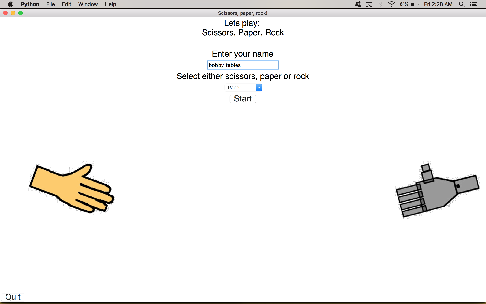
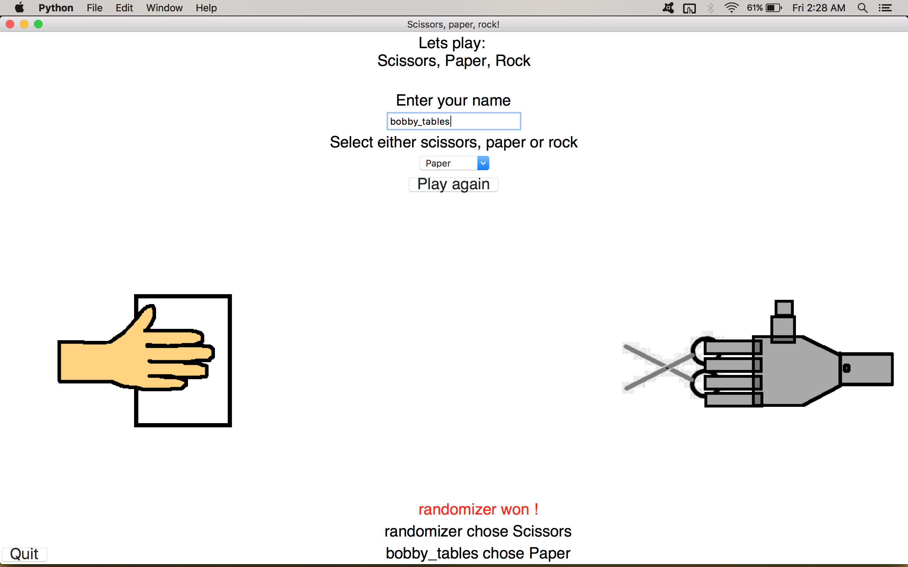

# Scissors Paper Rock

Built using Python 3 & tkinter (GUI package included in the standard library).

## Usage

```$ cd Scissors_Paper_Rock```

```$ python3 play.py```

## Screens

---


---


---


---



---




Some tkinter tutorials:

- http://www.tkdocs.com/tutorial/index.html

- http://www.python-course.eu/python_tkinter.php

Disclaimer: Images drawn in ms paint.

First ever project :) 